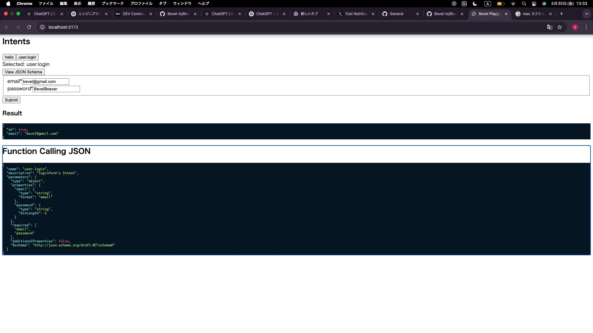

# ✫ Bevel.ts

**Type-Safe APIs. Intent-Driven Design. LLM-Ready.**

[⭐ Star us on GitHub](https://github.com/Bevel-ts/Bevel.ts) if you believe backends should be expressive, composable, and AI-native.

Bevel.ts is a modern backend framework that turns *intent* into production-ready APIs — instantly.
Define what your system should do, and let Bevel.ts generate the type-safe, scalable, and AI-compatible infrastructure for it.

> ✨ You define the "what" — Bevel.ts handles the "how".



---

## 🚀 Quick Start

```bash
npx bevel-ts init my-app
cd my-app
npm install
npm run dev
npm run ui
```

Then open [`http://localhost:5173`](http://localhost:5173) to explore your API live in the Playground UI.

---

## 🎮 Playground UI — Live, Typed, AI-Ready

Bevel.ts comes with a full-featured visual UI to explore, test, and validate your backend intents.

| ✅ Feature                 | Description                                                           |
| ------------------------- | --------------------------------------------------------------------- |
| Intent Listing            | Auto-fetch from `/intents`, rendered in sidebar                       |
| Intent Selection          | State-aware, click to activate                                        |
| JSON Schema Fetching      | Pulls from `/intents/:name/schema`                                    |
| Auto Form Generation      | Built from schema via `react-jsonschema-form`                         |
| Type-Safe Input Execution | Call your API via `POST /api/:intent`                                 |
| JSON Response Viewer      | Pretty printed with syntax highlight (Prism.js)                       |
| Function Calling Modal    | Show full GPT-callable schema with dialog + animation (Framer Motion) |

### 🧠 Why It Matters

| For...          | You get...                                                         |
| --------------- | ------------------------------------------------------------------ |
| Developers      | Instant feedback on intent behavior                                |
| Type Systems    | Schema-derived inputs ensure Zod-level safety                      |
| GPT Integrators | View/export OpenAI-compatible Function Calling JSON                |
| Teams & PMs     | A living, shareable API spec — no Swagger, no Postman, no friction |

> **This is your live backend design interface.**
> *If it runs in Playground, it works in production.*

---

## ✨ Why Bevel.ts?

### 🧠 Intent-Driven API Design

Define the *what*, not the *how*.

```ts
defineIntent("user.login", {
  input: z.object({ email: z.string(), password: z.string() }),
  handler: async ({ input }) => { /* ... */ }
})
```

No REST boilerplate. No GraphQL schema stitching. Just intent and logic — fully typed.

---

### 🔮 LLM-Native by Design

Generate OpenAI-compatible schemas out of the box.
Integrates with GPT-4o, Claude, LangChain, or any agent framework in seconds.

---

### 🌍 Edge-Optimized Stack

* Deploy instantly to **Cloudflare Workers** or **Vercel Edge**
* Bun & Node 18+ ready
* Auth + ORM + DX tools all in one

---

## 🛡 Tech Stack

| Layer       | Technology                                |
| ----------- | ----------------------------------------- |
| Runtime     | Bun / Node.js (18+)                       |
| HTTP Server | Hono                                      |
| ORM         | Drizzle ORM (type-safe SQL)               |
| Auth        | Lucia (modular, vendor-free)              |
| CLI         | bevel CLI                                 |
| Deploy      | Cloudflare Workers / Vercel Edge          |
| UI          | React + shadcn/ui + Radix + Framer Motion |
| AI          | OpenAI Function Calling JSON export       |

---

## 🔥 Feature Comparison

| Feature         | Bevel.ts          | tRPC       | Express     |
| --------------- | ----------------- | ---------- | ----------- |
| Type Safety     | ✅ Full (Zod + TS) | ✅ Full     | ❌ None      |
| API Design      | Intent-based      | RPC        | REST/manual |
| LLM Integration | ✅ Built-in        | ❌          | ❌           |
| Edge Readiness  | ✅ Out-of-the-box  | ⚠️ Partial | ⚠️ Limited  |
| ORM + Auth      | ✅ Drizzle + Lucia | ❌          | ❌           |
| Playground / DX | ✅ Built-in UI     | ❌          | ❌           |

---

## 📦 Use Cases

* Build **LLM tools** with real APIs
* Launch **typed internal tools** at lightspeed
* Create **Edge-ready SaaS backends**
* Replace messy REST layers with clean intent

---

## ✫ Philosophy

> 🧠 **Bevel.ts is backend as language.**
>
> We believe backends are not just infrastructure — they are *interfaces of intent*.
> With Bevel.ts, you express what your system *means to do*, and your architecture reflects that — clearly, structurally, and type-safely.
>
> It’s not about routes. Not about servers.
> It’s about **declaring meaning** — and letting that become your API.

---

## ⭐ Ready to rethink backends?

[🌟 Star us on GitHub](https://github.com/Bevel-ts/Bevel.ts) if you believe in type-safe, AI-native, intent-based backend design.

Let’s build APIs the way Beavers build dams:
with precision, intent, and elegance. ✫

---

## 📎 Appendix

> Want to contribute, extend or deploy to production?
> See [`docs/`](/docs) or join our Discord for dev discussions.
